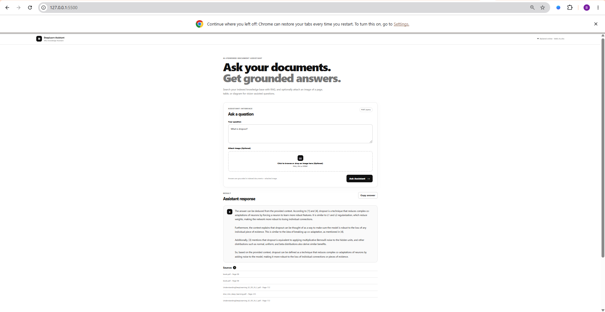
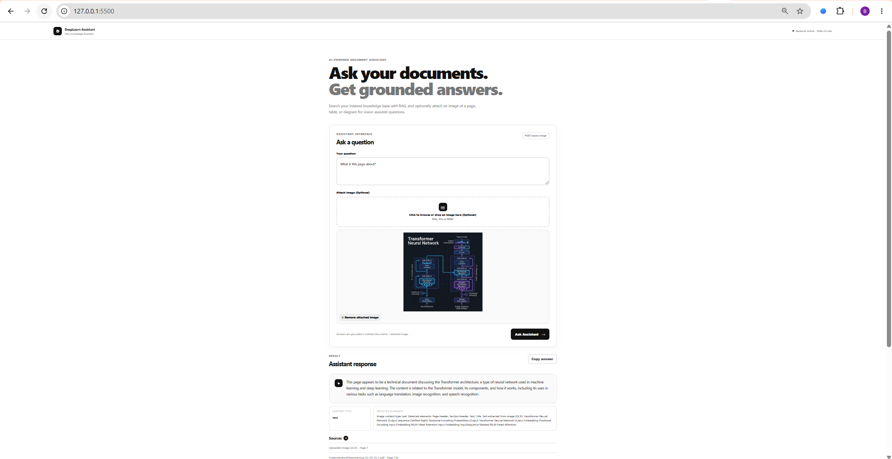

# RAG-Powered Document Assistant

An end-to-end **Retrieval-Augmented Generation (RAG)** system for answering questions about Deep Learning documents using semantic retrieval, a persistent ChromaDB vector store, and a local LLM through Ollama.

The project also includes an **Extended Computer Vision pipeline** that uses YOLO-based document layout detection and OCR to extract information from uploaded document images and combine it with the RAG pipeline.

---

## 1. Overview

The system allows users to ask questions about a collection of Deep Learning documents and receive answers grounded in the retrieved document context.

The complete system consists of:

- A **RAG notebook** for document processing, chunking, embeddings, retrieval, evaluation, and Computer Vision experiments.
- A **FastAPI backend** providing the RAG API.
- A browser-based **HTML/CSS/JavaScript frontend**.
- A persisted **ChromaDB vector store** containing 5,666 document chunks.
- A **YOLOv8 DocLayNet model** for document-layout detection.
- **Tesseract OCR** for extracting text from detected text-oriented regions.
- A local **Llama 3.2 3B** model served through Ollama.

### Main Features

- PDF document processing
- Page-level metadata preservation
- Recursive text chunking
- Semantic embeddings
- Persistent vector database
- Top-k semantic retrieval
- Grounded LLM generation
- Source and page references
- Out-of-domain question handling
- Image upload
- YOLO document-layout detection
- OCR-based text extraction
- Image-to-RAG context fusion
- FastAPI API
- Automated backend tests
- Browser-based user interface

---

# 2. Project Objectives

The main objectives of the project are to:

- Process and inspect PDF documents.
- Extract text while preserving source and page metadata.
- Split documents into meaningful overlapping chunks.
- Generate semantic embeddings.
- Persist embeddings in a vector database.
- Retrieve relevant information for user questions.
- Generate answers grounded in retrieved context.
- Provide source and page information with answers.
- Evaluate retrieval and generation quality.
- Test behavior on questions outside the knowledge base.
- Extend the RAG pipeline with document-layout detection and OCR.
- Provide an end-to-end application through a web interface.

---

# 3. Domain and Dataset

## Domain

The project focuses on the **Deep Learning** domain.

The knowledge base contains educational material covering topics including:

- Neural Networks
- Backpropagation
- Gradient Descent
- Activation Functions
- Convolutional Neural Networks
- Recurrent Neural Networks
- Dropout
- Vanishing Gradients
- Self-Attention
- Transformers
- Overfitting

## Source Documents

The knowledge base contains three PDF documents:

```text
rag_backend/data/pdfs/
├── book.pdf
├── dive_into_deep_learning.pdf
└── UnderstandingDeepLearning_02_09_26_C.pdf
```

The PDFs are processed page-by-page using `pypdf`.

Each extracted page is associated with:

- Source document
- Page number

Empty pages are filtered before chunking.

---

# 4. System Architecture

```text
                         +----------------------+
                         |        User          |
                         +----------+-----------+
                                    |
                                    v
                         +----------------------+
                         |       Frontend       |
                         |    HTML/CSS/JS       |
                         +----------+-----------+
                                    |
                                    | HTTP
                                    v
                         +----------------------+
                         |       FastAPI        |
                         |       Backend        |
                         +----------+-----------+
                                    |
                                    v
                         +----------------------+
                         |      ChromaDB        |
                         |  Semantic Retrieval  |
                         +----------+-----------+
                                    |
                                    v
                         +----------------------+
                         |   Retrieved Context  |
                         +----------+-----------+
                                    |
                                    v
                         +----------------------+
                         |   Grounded Prompt    |
                         +----------+-----------+
                                    |
                                    v
                         +----------------------+
                         |  Ollama / Llama 3.2  |
                         +----------+-----------+
                                    |
                                    v
                         +----------------------+
                         |   Answer + Sources   |
                         +----------------------+
```

## Extended Computer Vision Architecture

```text
Uploaded Document Image
          |
          v
YOLO Document Layout Detection
          |
          v
Detected Document Regions
          |
          +------------------+
          |                  |
          v                  v
   Text-like Regions    Tables / Pictures
          |
          v
       OCR
          |
          v
Extracted Image Information
          |
          v
Question + Image Context
          |
          v
Semantic Retrieval
          |
          v
Retrieved Document Context
          |
          v
Grounded LLM Generation
          |
          v
Answer + Sources
```

---

# 5. RAG Pipeline

```text
PDF Documents
      |
      v
Page-Level Parsing
      |
      v
Text Chunking
      |
      v
Embedding Generation
      |
      v
Persistent ChromaDB
      |
      v
Semantic Retrieval
      |
      v
Retrieved Context
      |
      v
Grounded Prompt
      |
      v
Llama 3.2 3B
      |
      v
Answer + Sources
```

---

# 6. Document Processing

The notebook uses `pypdf` to process the source PDFs page-by-page.

The processing pipeline includes:

1. Discovering PDF files.
2. Opening each PDF.
3. Extracting text from each page.
4. Recording source and page metadata.
5. Removing pages with empty extracted text.
6. Passing the resulting documents to the chunking stage.

Page-level metadata is preserved so that retrieved chunks can later be associated with their original source document and page.

---

# 7. Chunking Strategy

The project uses LangChain's:

```text
RecursiveCharacterTextSplitter
```

Configuration:

```text
Chunk size:    1000 characters
Chunk overlap: 200 characters
```

### Rationale

A chunk size of 1000 characters provides enough surrounding context for technical Deep Learning explanations while keeping retrieved passages focused.

The 200-character overlap preserves information across neighboring chunks and reduces the chance of losing context at chunk boundaries.

The recursive splitter also attempts to preserve natural text boundaries when creating chunks.

---

# 8. Embeddings

The project uses Sentence Transformers for semantic embedding generation.

```text
Model:
all-MiniLM-L6-v2
```

Each text chunk is transformed into a numerical vector representing its semantic meaning.

These vectors are stored in ChromaDB and used for semantic similarity retrieval.

---

# 9. Vector Database

The project uses:

```text
ChromaDB
```

The persistent vector store is located at:

```text
rag_backend/data/vector_store/
```

The collection name is:

```text
deep_learning_docs
```

The final collection contains:

```text
5,666 chunks
```

The vector store is persisted to disk so the backend can load the existing embeddings rather than rebuilding the complete database for every request.

---

# 10. Retrieval

For each user question, the backend performs semantic similarity search against the persisted ChromaDB collection.

The default configuration retrieves:

```text
Top K = 5
```

Each retrieved result contains information including:

- Text content
- Source document
- Page number

The retrieved chunks are then inserted into the grounded generation prompt.

---

# 11. Grounded Generation

The project uses Ollama to run the local LLM.

```text
LLM:
Llama 3.2 3B

Runtime:
Ollama
```

The generation prompt instructs the model to:

- Use only the supplied retrieved context.
- Avoid unsupported information.
- State when the requested information is unavailable.
- Provide a concise answer.
- Include relevant source and page information.

This design helps keep generated responses grounded in the project's document collection.

---

# 12. Evaluation

The system was evaluated using ten Deep Learning questions.

The evaluation set covers:

1. Backpropagation
2. Gradient Descent
3. Activation Functions
4. Convolutional Neural Networks
5. CNNs vs RNNs
6. Dropout
7. Vanishing Gradients
8. Self-Attention
9. Transformers
10. Overfitting

Each answer was manually evaluated for:

- Correctness
- Groundedness in retrieved context

## Evaluation Results

| Metric | Result |
|---|---:|
| Questions evaluated | 10 |
| Correct answers | 9 / 10 |
| Correctness | 90% |
| Grounded answers | 9 / 10 |
| Groundedness | 90% |

One question, **CNNs vs RNNs**, was not sufficiently supported by the retrieved context.

This demonstrates a retrieval limitation where relevant information may exist elsewhere in the document collection but is not sufficiently represented in the retrieved top-k chunks.

---

# 13. Failure Cases and Mitigation

The system was also tested with questions outside the Deep Learning knowledge base.

Examples:

```text
What is the capital of France?

What is the boiling point of water at sea level?

How do I repair a car engine?
```

Since these topics are outside the project's document collection, the expected behavior is to indicate that the required information is not available in the provided context.

### Mitigation

The grounded prompt explicitly instructs the LLM not to introduce information that is unsupported by the retrieved context.

Potential future improvements include:

- Retrieval confidence thresholds
- Query rewriting
- Hybrid semantic and keyword retrieval
- Reranking
- Larger evaluation datasets
- Automated groundedness evaluation

---

# 14. Computer Vision Extension

The project includes an extended Computer Vision pipeline for document image analysis.

The YOLO model is located at:

```text
rag_backend/models/yolov8n-doclaynet.pt
```

The model is used for document-layout detection.

Detected document elements can include:

- Text
- Title
- Table
- Picture
- Caption
- List-item
- Section-header
- Footnote
- Formula

The detected regions are classified according to their content type and incorporated into the image-based RAG workflow.

---

# 15. OCR

Text-oriented document regions are processed using:

```text
Tesseract OCR
```

OCR is applied to regions such as:

- Text
- Title
- Caption
- List-item
- Section-header
- Footnote

Tables and pictures are handled separately as visual content types.

---

# 16. Image-Based RAG

The Computer Vision extension combines image understanding with the existing RAG pipeline.

The workflow is:

```text
Uploaded Image
      |
      v
YOLO Layout Detection
      |
      v
Detected Regions
      |
      +---- Text-like Regions ----> OCR
      |
      +---- Tables / Pictures
      |
      v
Extracted Image Information
      |
      v
Question + Image Information
      |
      v
Semantic Retrieval
      |
      v
Retrieved Document Context
      |
      v
Grounded LLM Generation
      |
      v
Answer + Sources
```

The same `deep_learning_docs` ChromaDB collection is used as the document knowledge source.

---

# 17. Backend

The backend is implemented using:

```text
FastAPI
```

Backend directory:

```text
rag_backend/
```

## Backend Structure

```text
rag_backend/
├── app/
│   ├── __init__.py
│   ├── main.py
│   ├── api/
│   │   ├── __init__.py
│   │   └── routes/
│   │       ├── __init__.py
│   │       └── query.py
│   ├── core/
│   │   ├── __init__.py
│   │   └── config.py
│   ├── schemas/
│   │   ├── __init__.py
│   │   └── query.py
│   ├── services/
│   │   ├── __init__.py
│   │   ├── generation.py
│   │   ├── retrieval.py
│   │   └── vision.py
│   └── utils/
│       ├── __init__.py
│       └── logging_config.py
├── data/
│   ├── pdfs/
│   └── vector_store/
├── models/
│   └── yolov8n-doclaynet.pt
├── tests/
│   ├── __init__.py
│   └── test_query.py
├── .env
├── .gitignore
├── README.md
└── requirements.txt
```

## Main Backend Components

### `app/main.py`

Creates and configures the FastAPI application, middleware, and application startup.

### `app/api/routes/query.py`

Defines the API routes used for document questions and image-based queries.

### `app/core/config.py`

Provides centralized configuration loaded from environment variables and `.env`.

### `app/schemas/query.py`

Defines API request and response schemas.

### `app/services/retrieval.py`

Handles semantic retrieval from ChromaDB.

### `app/services/generation.py`

Handles grounded LLM response generation through Ollama.

### `app/services/vision.py`

Provides the Computer Vision functionality for document-layout detection and OCR.

---

# 18. API Reference

## Health Check

```http
GET /health
```

Returns the backend status and the number of documents/chunks available in the vector store.

Example:

```bash
curl http://localhost:8000/health
```

Example response:

```json
{
  "status": "ok",
  "collection_count": 5666
}
```

---

## Query

```http
POST /query
```

Receives a text question and returns a grounded answer with retrieved source information.

Example:

```bash
curl -X POST http://localhost:8000/query ^
  -H "Content-Type: application/json" ^
  -d "{\"question\":\"What is dropout?\"}"
```

---

## Image Query

```http
POST /query-image
```

Accepts an uploaded image together with a question.

The endpoint performs:

1. YOLO document-layout detection.
2. OCR on text-oriented regions.
3. Image-context extraction.
4. Semantic retrieval.
5. Grounded LLM generation.

Example:

```bash
curl -X POST http://localhost:8000/query-image ^
  -F "question=What is this page about?" ^
  -F "image=@path/to/image.jpg"
```

---

## Interactive API Documentation

When the backend is running, FastAPI provides interactive documentation at:

```text
http://localhost:8000/docs
```

---

# 19. Backend Setup

From the project root:

```bash
cd rag_backend
```

Create a virtual environment:

```bash
python -m venv .venv
```

Activate it on Windows:

```bash
.venv\Scripts\activate
```

Install dependencies:

```bash
pip install -r requirements.txt
```

Make sure Ollama is installed and the required model is available:

```text
llama3.2:3b
```

Start the backend:

```bash
uvicorn app.main:app --reload --port 8000
```

The backend will run at:

```text
http://localhost:8000
```

---

# 20. Environment Variables

The backend configuration is centralized in `app/core/config.py`.

The main configurable values are:

| Variable | Default / Example | Purpose |
|---|---|---|
| `VECTOR_STORE_DIR` | `./data/vector_store` | Persistent ChromaDB location |
| `PDF_DIR` | `./data/pdfs` | Source PDF directory |
| `COLLECTION_NAME` | `deep_learning_docs` | ChromaDB collection |
| `EMBEDDING_MODEL` | `all-MiniLM-L6-v2` | Sentence Transformer model |
| `LLM_MODEL` | `llama3.2:3b` | Ollama LLM |
| `OLLAMA_HOST` | `http://localhost:11434` | Ollama server |
| `TOP_K` | `5` | Number of retrieved chunks |
| `CHUNK_SIZE` | `1000` | Chunk size |
| `CHUNK_OVERLAP` | `200` | Chunk overlap |
| `INGEST_BATCH_SIZE` | `500` | Embedding/vector-store batch size |
| `CORS_ORIGINS` | `http://localhost:5500` | Allowed frontend origins |
| `YOLO_MODEL_PATH` | `./models/yolov8n-doclaynet.pt` | YOLO model path |
| `YOLO_CONFIDENCE` | `0.25` | YOLO detection confidence threshold |

Sensitive/local `.env` files should not be committed to the repository.

---

# 21. Frontend

The frontend is a lightweight browser-based interface built with:

- HTML
- CSS
- JavaScript

The frontend was implemented using HTML/CSS/JavaScript with the project's approved frontend approach.

Frontend directory:

```text
rag_frontend/rag_frontend/
```

## Frontend Structure

```text
rag_frontend/
└── rag_frontend/
    ├── .env
    ├── app.js
    ├── config.js
    ├── config.js.example
    ├── index.html
    ├── README.md
    └── style.css
```

### Main Files

`index.html`  
Contains the application interface.

`style.css`  
Contains the visual styling.

`app.js`  
Handles user interaction, API requests, responses, image uploads, loading states, and error handling.

`config.js`  
Contains the local backend API URL configuration.

`config.js.example`  
Provides an example frontend configuration.

---

# 22. Frontend Setup

Navigate to the frontend directory:

```bash
cd rag_frontend/rag_frontend
```

Configure the backend URL in `config.js`.

For the default local setup:

```javascript
window.API_BASE = "http://127.0.0.1:8000";
```

Start a local HTTP server:

```bash
python -m http.server 5500
```

Open the application at:

```text
http://127.0.0.1:5500
```

Make sure the FastAPI backend is running before sending questions from the frontend.

---

# 23. Tests

Backend tests are located at:

```text
rag_backend/tests/test_query.py
```

The project uses:

- Pytest
- FastAPI TestClient

The tests cover:

- Valid query requests
- Invalid request validation
- API behavior
- Backend integration behavior

Run the tests from the backend directory:

```bash
pytest -q
```

Current test result:

```text
5 passed
```

---

# 24. Notebook

The complete experimental RAG pipeline is provided in:

```text
notebooks/rag_pipeline.ipynb
```

The notebook includes:

- Document loading
- Document inspection
- PDF parsing
- Page-level metadata
- Chunking
- Embedding generation
- ChromaDB creation
- Retrieval experiments
- Grounded prompting
- LLM generation
- Ten-question evaluation
- Failure-case testing
- Vector-store configuration
- YOLO document-layout detection
- OCR
- Image-based RAG

The notebook represents the experimentation and evaluation stage, while the FastAPI backend provides the application API using the persisted vector store.

---

# 25. Exported RAG Configuration

The final RAG configuration is:

```json
{
  "chunk_size": 1000,
  "chunk_overlap": 200,
  "embedding_model": "all-MiniLM-L6-v2",
  "vector_database": "ChromaDB",
  "collection_name": "deep_learning_docs",
  "llm_model": "llama3.2:3b"
}
```

The persisted vector store is loaded by the backend without rebuilding embeddings during normal API requests.

---

# 26. Project Structure

```text
rag_powered_assistant/
│
├── .gitignore
├── run.bat
│
├── screenshots/
│   ├── dropout-rag.png
│   └── transformer-image-rag.png
│
├── rag_backend/
│   ├── .env
│   ├── .gitignore
│   ├── README.md
│   ├── requirements.txt
│   │
│   ├── app/
│   │   ├── __init__.py
│   │   ├── main.py
│   │   ├── api/
│   │   │   ├── __init__.py
│   │   │   └── routes/
│   │   │       ├── __init__.py
│   │   │       └── query.py
│   │   ├── core/
│   │   │   ├── __init__.py
│   │   │   └── config.py
│   │   ├── schemas/
│   │   │   ├── __init__.py
│   │   │   └── query.py
│   │   ├── services/
│   │   │   ├── __init__.py
│   │   │   ├── generation.py
│   │   │   ├── retrieval.py
│   │   │   └── vision.py
│   │   └── utils/
│   │       ├── __init__.py
│   │       └── logging_config.py
│   │
│   ├── data/
│   │   ├── pdfs/
│   │   └── vector_store/
│   │
│   ├── models/
│   │   └── yolov8n-doclaynet.pt
│   │
│   └── tests/
│       ├── __init__.py
│       └── test_query.py
│
├── rag_frontend/
│   └── rag_frontend/
│       ├── .env
│       ├── app.js
│       ├── config.js
│       ├── config.js.example
│       ├── index.html
│       ├── README.md
│       └── style.css
│
└── notebooks/
    └── rag_pipeline.ipynb
```

---

# 27. Technology Stack

| Category | Technology |
|---|---|
| Programming Language | Python |
| Backend Framework | FastAPI |
| ASGI Server | Uvicorn |
| RAG Framework | LangChain |
| PDF Processing | pypdf |
| Text Splitting | RecursiveCharacterTextSplitter |
| Embeddings | Sentence Transformers |
| Embedding Model | all-MiniLM-L6-v2 |
| Vector Database | ChromaDB |
| LLM Runtime | Ollama |
| LLM | Llama 3.2 3B |
| Computer Vision | Ultralytics YOLO |
| Document Layout Model | YOLOv8 DocLayNet |
| OCR | Tesseract |
| Frontend | HTML / CSS / JavaScript |
| Testing | Pytest / FastAPI TestClient |

---

# 28. Screenshots

## RAG Chat

The frontend demonstrates a Deep Learning question answered using retrieved document context and source information.



## Multimodal Image Query

The frontend also supports uploading a document image and processing it through the Computer Vision + RAG pipeline.



---

# 29. Assignment Requirements Coverage

| Requirement | Implementation |
|---|---|
| Open-domain selection | Deep Learning |
| Source document collection | 3 Deep Learning PDFs |
| Document inspection | Implemented in notebook |
| PDF parsing | `pypdf` |
| Page metadata | Source + page preserved |
| Chunking strategy | RecursiveCharacterTextSplitter |
| Chunk size | 1000 |
| Chunk overlap | 200 |
| Embeddings | Sentence Transformers |
| Embedding model | `all-MiniLM-L6-v2` |
| Vector database | ChromaDB |
| Persistent vector store | `rag_backend/data/vector_store/` |
| Semantic retrieval | Top-5 retrieval |
| Grounded prompt | Context-restricted generation |
| Citation-style grounding | Source + page references |
| Evaluation questions | 10 |
| Correctness evaluation | 90% |
| Groundedness evaluation | 90% |
| Failure cases | Included |
| Backend | FastAPI |
| Health endpoint | `/health` |
| Query endpoint | `/query` |
| Image endpoint | `/query-image` |
| Environment configuration | `.env` + centralized settings |
| Backend tests | Pytest / TestClient |
| Frontend | HTML / CSS / JavaScript |
| Image upload | Implemented |
| YOLO extension | Implemented |
| OCR | Tesseract |
| Image-based RAG | Implemented |
| Notebook | `notebooks/rag_pipeline.ipynb` |
| Evaluation results | Included |
| Application screenshots | Included |

---

# 30. Limitations and Future Improvements

The current implementation can be improved through:

- Hybrid keyword and semantic retrieval.
- Retrieval reranking.
- Query rewriting.
- Retrieval confidence thresholds.
- Larger evaluation datasets.
- Automated groundedness metrics.
- Improved table understanding.
- Improved diagram understanding.
- More robust OCR processing.
- More advanced image-based retrieval.
- Production deployment configuration.

---

# 31. Reproducibility

To reproduce the project:

### 1. Clone the repository

```bash
git clone https://github.com/basmalaazab/rag-powered-assistant.git
cd rag-powered-assistant
```

### 2. Set up the backend

```bash
cd rag_backend
python -m venv .venv
.venv\Scripts\activate
pip install -r requirements.txt
```

### 3. Configure Ollama

Make sure Ollama is installed and the required model is available:

```text
llama3.2:3b
```

### 4. Start the backend

```bash
uvicorn app.main:app --reload --port 8000
```

### 5. Start the frontend

Open a second terminal:

```bash
cd rag_frontend/rag_frontend
python -m http.server 5500
```

Then open:

```text
http://127.0.0.1:5500
```

### 6. Use the persisted vector store

The backend loads the existing ChromaDB vector store from:

```text
rag_backend/data/vector_store/
```

The vector database does not need to be rebuilt for normal application usage.

### 7. Reproduce the experimental pipeline

The complete experimental workflow is available in:

```text
notebooks/rag_pipeline.ipynb
```

---

# 32. Conclusion

This project implements a complete end-to-end RAG-powered Document Assistant for Deep Learning content.

The system covers:

- PDF processing
- Page-level metadata
- Text chunking
- Semantic embeddings
- Persistent vector storage
- Semantic retrieval
- Grounded LLM generation
- Source-aware answers
- Evaluation and failure-case analysis
- FastAPI backend
- Automated testing
- Browser-based frontend
- YOLO document-layout detection
- OCR
- Image-based RAG

The final knowledge base contains **5,666 document chunks**, and the evaluated RAG system achieved **90% correctness** and **90% groundedness** across ten manually reviewed questions.

The project combines the experimental notebook, persisted vector database, FastAPI backend, Computer Vision extension, and web frontend into a complete end-to-end application.
